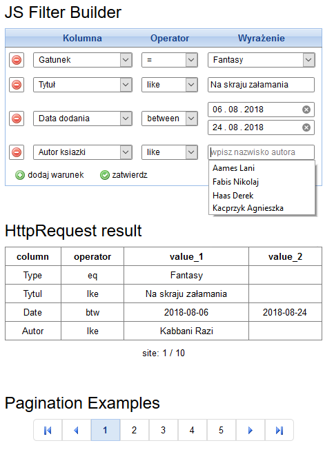

## JS Filter Builder
----
HTML / JS / ajax - **Dynamic Filter Generator**

The script generates dynamic inputs, which data can be sent via POST (XMLHttpRequest) to any php script. 

In a simple dictionary (*selectData* object) you can define column description, input type, associated operators, datalist suggestions and placeholder for value fields.

The results are collected in real time. The filtering criteria are stored in the browser's LocalStorage. Pagination engine allow send extra info about current page and ammount of subsites.

<p align="center">
  
</p>


#### defining the dictionary :
```html
<script>
    // values for the column `skrytka`
    let datalist_skrytki = {
        "domyslny": [
            "Wysłane",
            "Odebrane"
        ],
        "zapasowy": [
            "Wysłane",
            "Odebrane"
        ]
    };

    // values for the column `typ`
    let datalist_typ = [
        "Cooking ",
        "Fantasy",
        "Horror",
        "Science-fiction",
        "Romance "
    ];

    // definition of operators
    let operatorsList = {
        "gt"  : ">",
        "le"  : "<",
        "eq"  : "=",
        "btw" : "between",
        "lke" : "like"
    };

    // definition of columns, allowed operators and value types
    let selectData = {
        "Skrytka" : {
            "text"      : "Skrytka",
            "type"      : "skrytkaList",
            "operators" : ["eq"],
            "data"      : datalist_skrytki
        },
        "Type": {
            "text"      : "Gatunek",
            "type"      : "list",
            "operators" : ["eq"],
            "data"      : datalist_typ
        },
        "Tytul": {
            "text"      : "Tytuł",
            "type"      : "text",
            "operators" : ["eq", "lke"],
            "data"      : "datalist_tytuly"
        },
        "Autor": {
            "text"      : "Autor ksiazki",
            "type"      : "text",
            "operators" : ["lke", "eq"],
            "p_holder"  : "wpisz nazwisko autora",
            "data"      : "datalist_autorzy"
        },
        "Date" : {
            "text"      : "Data dodania",
            "type"      : "date",
            "operators" : ["eq", "gt", "le", "btw"]
        },
    };
</script>

<!-- datalist suggestions for books title -->
<datalist id="datalist_tytuly">
    <option value="365 dni">
    <option value="Tatuażysta z Auschwitz">
    <option value="Na skraju załamania">
    <option value="Apartament w Paryżu">
    <option value="Hashtag">
    <option value="Rywalka">
</datalist>

<!-- datalist suggestions for books authors -->
<datalist id="datalist_autorzy">
    <option value="Aames Lani">
    <option value="Fabis Nikolaj">
    <option value="Haas Derek">
    <option value="Kabbani Razi">
    <option value="Kacman Perła">
    <option value="Kacprzyk Agnieszka">
</datalist>
```

#### obtained POST data : 
```php
Array
(
    [filtering] => Array
        (
            [0] => {
                "column"    : "skrytka",
                "operator"  : "eq",
                "value_1"   : "domyslny",
                "value_2"   : ""
                }
            [1] => {
                "column"    : "send_date",
                "operator"  : "btw",
                "value_1"   : "2018-07-02",
                "value_2"   : "2018-08-31"}
            [2] => {
                "column"    : "tytul",
                "operator"  : "lke",
                "value_1"   : "pozdrowienia",
                "value_2"   : ""
                }
        )

    [site_current] => 1
)
```