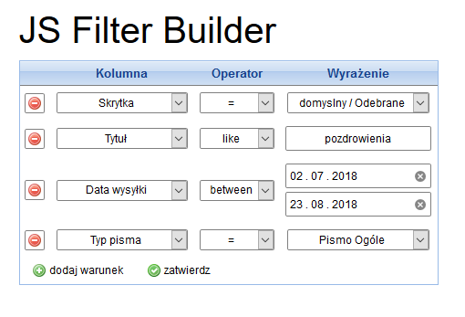
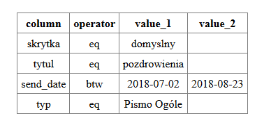

## JS Filter Builder
----
HTML / JS Dynamic filter generator. The script generates a form and inputs, which data can be sent by POST to any php script.

<p align="center">
  
</p>


#### input data :
```js
// values for the column `skrytka`
datalist_skrytki = {
    "domyslny": [
        "Wysłane",
        "Odebrane"
    ],
    "egzadm": [
        "Wysłane",
        "Odebrane"
    ]
};

// values for the column `typ`
datalist_typ = [
    "TW-1",
    "ADN",
    "Pismo Ogóle"
];

// definition of operators
var operatorsList = {
    "gt"  : ">",
    "le"  : "<",
    "eq"  : "=",
    "btw" : "between",
    "lke" : "like"
};

// definition of columns, allowed operators and value types
var selectData = {
    "skrytka" : {
        "text"      : "Skrytka",
        "type"      : "skrytkaList",
        "operators" : ["eq"],
        "data"      : datalist_skrytki
    },
    "send_date" : {
        "text"      : "Data wysyłki",
        "type"      : "date",
        "operators" : ["eq", "gt", "le", "btw"]
    },
    "typ": {
        "text"      : "Typ pisma",
        "type"      : "list",
        "operators" : ["eq", "lke"],
        "data"      : datalist_typ
    },
    "tytul": {
        "text"  : "Tytuł",
        "type"  : "text",
        "operators" : ["eq", "lke"]
    }
};
```

#### POST data : 
```php
Array
(
    [column] => Array
        (
            [0] => skrytka
            [1] => tytul
            [2] => send_date
            [3] => typ
        )

    [operator] => Array
        (
            [0] => eq
            [1] => eq
            [2] => btw
            [3] => eq
        )

    [value_1] => Array
        (
            [0] => domyslny
            [1] => pozdrowienia
            [2] => 2018-07-02
            [3] => Pismo Ogóle
        )

    [value_2] => Array
        (
            [0] => 
            [1] => 
            [2] => 2018-08-23
            [3] => 
        )

)
```

#### result.php : 
<p align="center">
  
</p>